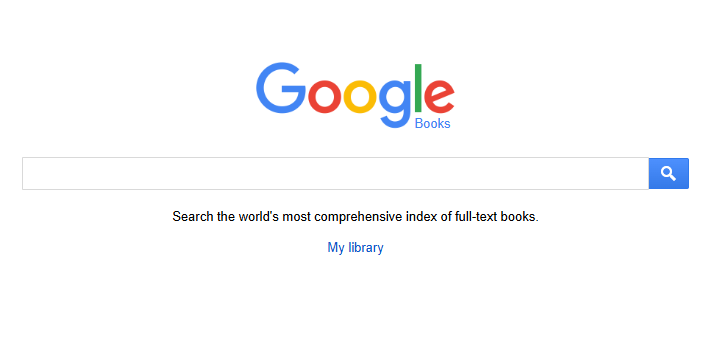
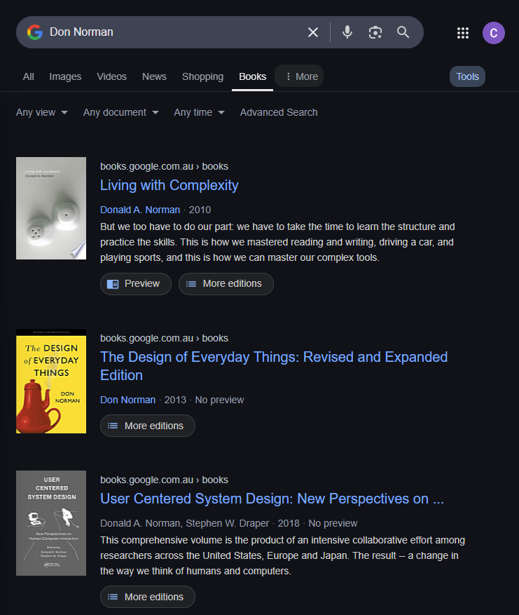

# Google Books API Project - Carrie

## Project Links
- Github: https://github.com/carriegale2710/google-books/tree/main
- Nology Project Brief: https://github.com/nology-tech/chicago-consultancy/blob/main/projects/google-books/README.md
- Trello Board: https://trello.com/b/F0uJrWLM/google-books-api-friday-2nd-may 

## Google Books: 
  - API: https://developers.google.com/books/docs/v1/using#WorkingVolumes
  - UI Layout: 
    - Search Page: https://books.google.com/
      - 
    - Results Page: https://www.google.com/search?udm=36&q=Don+Norman 
      - 

## Useful Resources:
- [Using Async Await](https://dmitripavlutin.com/javascript-fetch-async-await/)
- [Using Postman to Test APIs](https://www.blazemeter.com/blog/how-use-postman-test-apis)

### Styling:
- [Dialog element](https://developer.mozilla.org/en-US/docs/Web/HTML/Reference/Elements/dialog)
- [Media Queries](https://medium.com/geekculture/everything-about-css-media-queries-3e9786294b81)

